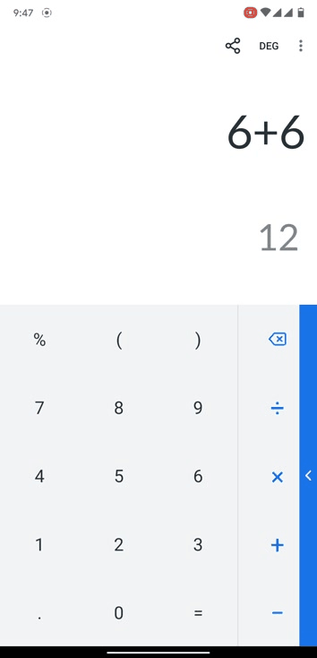
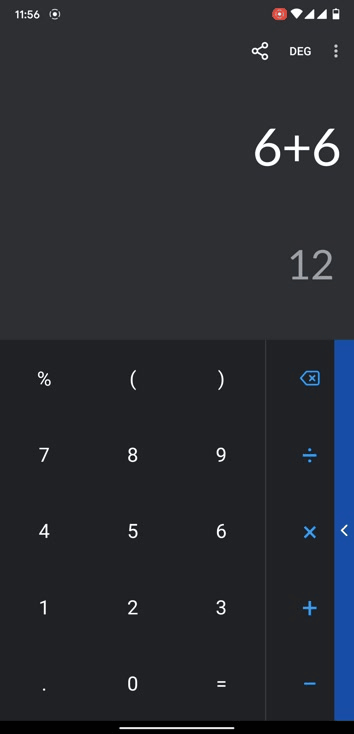

# Calculator Plus


A Simple Calculator with rich features for daily use.

The Calculator Plus provides simple and advanced mathematical functions for day to day use. It is packed with multiple features like smart calculations, number seperator, answer precision etc. Calculator Plus comes with Light and Dark Theme and can also adapt to system theme if configured. Its design is inspired by Material Design. It is very efficient calculator with advanced error handling. It is designed to handle errors intelligently.

## Screenshots 📱 

|Light Mode 🌞 | Dark Mode 🌚 |
|--------------|---------------|
||

## Why use Calculator Plus ❓ 
1. **Light weight**  
It is very light app, only 5 MB of size.

2. **User friendly design**  
User friendly design using Material Theme.

3. **No Ads whatsoever**  
Free to use with no hidden charges or ads.

4. **Smart calculations**  
It uses smart calculations to figure out what you are typing and automatically finds the result.

5. **Smart corrections**  
It tries to correct the equations using smart bracket resolution if they are not valid.

6. **Very flexible**  
Very flexible design and can be easily used on any display size.

7. **Very precise**  
It gives you precise results up to 10 decimal places

8. **Updated regularly**  
It is updated regularly with new designs and features, adapting new android versions.

9. **Very robust**  
It has a strong error handling methods which doesn't allow it it fail easily.

10. **Battery friendly**  
It is very efficient battery wise. It uses about 20% less battery compared to a normal calculator
<br/>

## Contribute 🤝
If you want to contribute to this app, you're always welcome!
See [Contributing Guidelines](./CONTRIBUTING.md). 

## Contact 📧 
[](mailto:arch1824@gmail.com)
[](https://twitter.com/arch1006)
[](https://www.linkedin.com/in/arch6/)
[](https://t.me/arch1824)

## Donation 💰
This app is totally free with no ads whatsoever. If you like this project and want to support me, please consider donating to this project.

[](https://paypal.me/arch10)

## Download ⬇️
Download the latest Version of the app from the play store.  
<a href='https://play.google.com/store/apps/details?id=com.gigaworks.tech.calculator&pcampaignid=MKT-Other-global-all-co-prtnr-py-PartBadge-Mar2515-1'>

## License 🔖
```
    Apache 2.0 License
    
    Copyright 2018-2021 Gigaworks Tech
    
    Licensed under the Apache License, Version 2.0 (the "License");
    you may not use this file except in compliance with the License.
    You may obtain a copy of the License at

    http://www.apache.org/licenses/LICENSE-2.0
    
    Unless required by applicable law or agreed to in writing, software
    distributed under the License is distributed on an "AS IS" BASIS,
    WITHOUT WARRANTIES OR CONDITIONS OF ANY KIND, either express or implied.
    See the License for the specific language governing permissions and
    limitations under the License.
```
